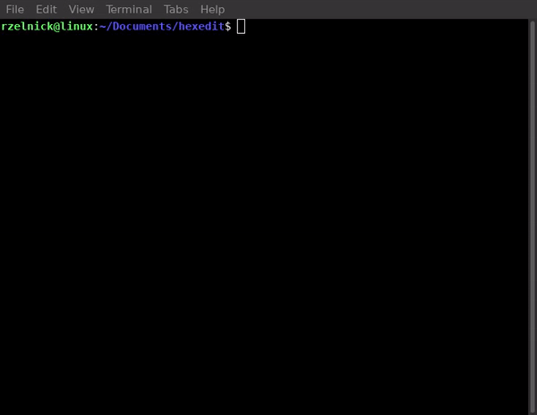

# Hexedit
[](https://www.travis-ci.com/rmzelnick/hexedit)



A hex editor (or binary file editor or byte editor) is a computer program that
allows for manipulation of the fundamental binary data that constitutes a
computer file. The name 'hex' comes from 'hexadecimal': a standard numerical
format for representing binary data. A typical computer file occupies multiple
areas on the platter(s) of a disk drive, whose contents are combined to form
the file. Hex editors that are designed to parse and edit sector data from the
physical segments of floppy or hard disks are sometimes called sector editors
or disk editors. 

## Getting Started

These instructions will get you a copy of the project up and running on your
local machine for development and testing purposes. See deployment for notes on
how to deploy the project on a live system.

### Prerequisites

In order to be able to install Hexedit you will need the following software:
Make, Autoconf, Automake, GCC, and optionally Doxygen if you wish to generate
documentation. If you're using a Windows system you may need to install cygwin
and use its package manager to install the aforementioned tools.

### Installing

The installation process is fairly simple once the prerequisites tools have
been acquired. The first step is to generate a configure script and run it.

```
$ ./boostrap.sh
$ ./configure
```

The next step is to build and install the software using make,

```
$ make
$ make install
```

## Running the tests

The hexedit project requires [Criterion](https://github.com/Snaipe/Criterion)
and comes with one unit test. Once Criterion is installed the tests can be
built the following way,

```
$ make check
$ cd tests
$ ./test
```

This should check for the core functionality of the software.

## Built With

* [GNU Compiler Collection](https://gcc.gnu.org/) - C++ compiler
* [GNU Make](https://www.gnu.org/software/make/) - a tool which controls the generation of executables and other non-source files of a program from the program's source files.
* [GNU Autoconf](https://www.gnu.org/software/autoconf/) - an extensible package of M4 macros that produce shell scripts to automatically configure software source code packages.
* [GNU Automake](https://www.gnu.org/software/automake/) - a tool for automatically generating Makefile.in files compliant with the GNU Coding Standards.
* [Doxygen](http://www.doxygen.nl/) - de facto standard tool for generating documentation from annotated C++ sources, but it also supports other popular programming languages such as C, Objective-C, C#, PHP, Java, Python, IDL (Corba, Microsoft, and UNO/OpenOffice flavors), Fortran, VHDL, Tcl, and to some extent D.
* [Criterion](https://github.com/Snaipe/Criterion) - A dead-simple, yet extensible, C and C++ unit testing framework.

## Contributing

Please read [CONTRIBUTING.md](CONTRIBUTING.md) for details on our code of
conduct, and the process for submitting pull requests to us.

## Versioning

We use [SemVer](http://semver.org/) for versioning. For the versions available,
see the [tags on this repository](https://github.com/rmzelnick/hexedit/tags).

## Authors

* **Rimack Zelnick** - *Initial work* - [rmzelnick](https://github.com/rmzelnick/)

## License

This project is licensed under the ISC License - see the
[LICENSE.md](LICENSE.md) file for details
